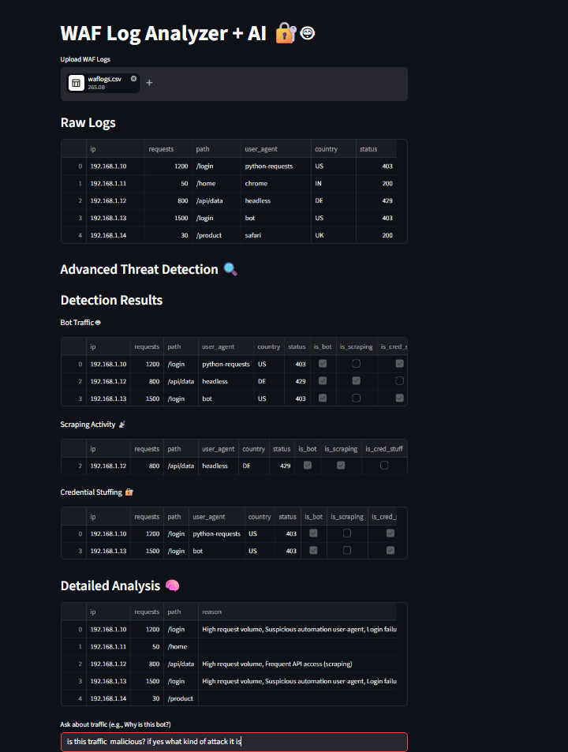
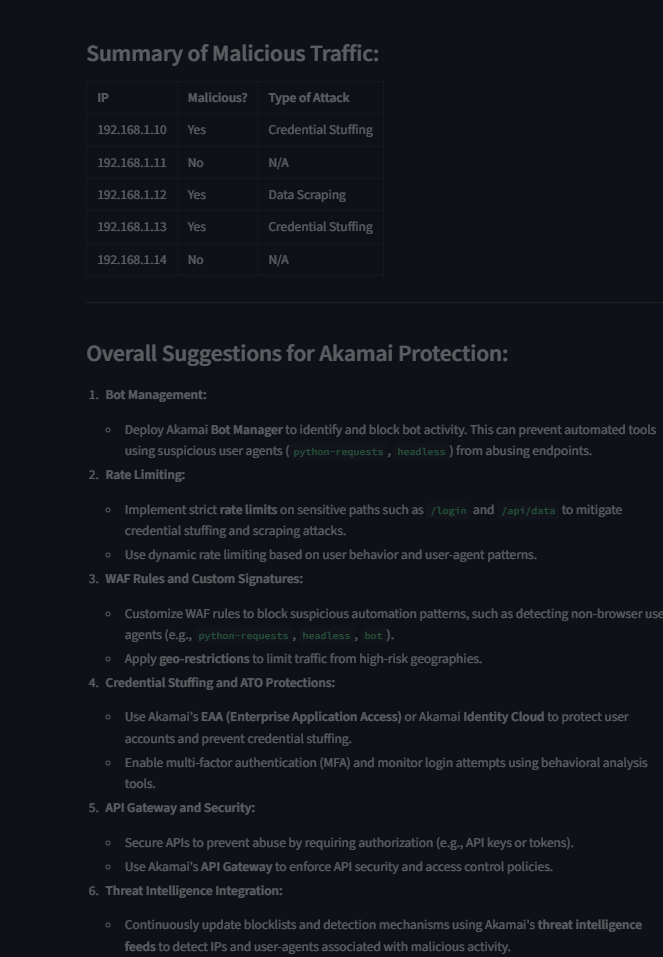
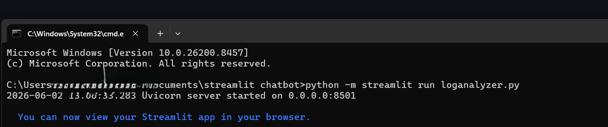

 AI-Powered WAF Log Analyzer
  Overview
This project is an AI-driven Web Application Firewall (WAF) log analyzer that detects:

Bot activity
Scraping behavior
Credential stuffing
Suspicious IP patterns

It uses Streamlit + LLM (AI) to provide human-readable threat explanations, similar to a security analyst.

 1. Key Features

✅ Detects bot behavior using request patterns & user-agents
✅ Identifies scraping & automation attacks
✅ Provides AI-based reasoning (why traffic is malicious)
✅ Simulates IP reputation scoring
✅ Interactive chatbot-style security analysis
✅ Visual threat insights

2. Why This Project Matters
Traditional log analysis is manual and slow.
This project:
-Automates security investigation
-Improves SOC efficiency
-Demonstrates AI + Security integration

  
3. Architecture

- WAF Logs (CSV)
- Data Processing using Pandas
- Detection Engine (Rules + Patterns)
- AI Analysis (LLM-based reasoning)
- Streamlit UI for visualization

 4. Screenshots

### 🔹 App Dashboard

### 🔹 Detection Results

### 🔹 AI Analysis

### 🔹 Command Line Run

5. Future Enhancements

Integration with real WAF APIs (Akamai)
Live traffic ingestion
Advanced AI threat scoring
SIEM integration (Splunk / Sentinel)

 Author
Shivani Tripathi
Application Security | AI Security | WAF Specialist
